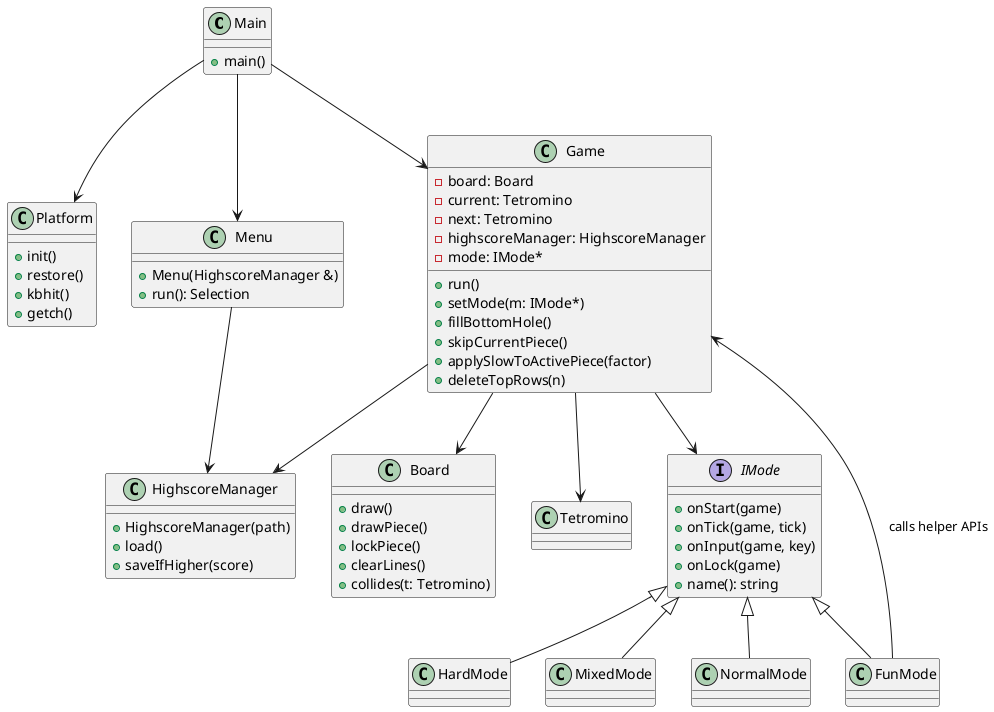

# ASCII TETRIS (tetris_cpp)

A small console-based Tetris clone written in C++ (C++20). The game runs in a Windows console and uses simple ASCII drawing and keyboard input. This README explains what the project offers, how it is built and run, how the game functions at a high level, and how to play.

---

## What this project is

A minimal ASCII Tetris implementation with multiple play modes and a persistent highscore.

## Features

- Multiple game modes selectable from the main menu:
  - "Normal Mode"
  - "Fun Mode"
  - "Hard Mode"
- Persistent highscore stored in `highscore.txt` (relative to the working directory where the executable is run).
- Simple keyboard controls for movement, rotation and hard drop.
- Fun-mode power-ups (activated by pressing 1-4 when available).
- Scoring and level progression based on lines cleared.

### Fun Mode — Power-ups (detailed)

Fun Mode grants up to four different power-ups that become available once you reach certain score thresholds. Each power-up also has a cooldown measured in the number of locked tetrominos (pieces) after activation. When a power-up is ready, the game shows a side-note with entries like:

  `1) Fill bottom hole (press 1)`

You can activate a ready power-up by pressing the corresponding number key (1-4) while playing. Exact behavior (taken from the source):

- Power-up 1
  - Effect: Fill bottom hole — the game searches from the bottom row upward and fills the first empty cell it finds (calls `Game::fillBottomHole()`).
  - Threshold: 1000 points
  - Cooldown: 15 locked pieces
  - Activation key: `1`

- Power-up 2
  - Effect: Skip current piece — the current piece is replaced by the next piece and a new next piece is spawned (calls `Game::skipCurrentPiece()`).
  - Threshold: 2500 points
  - Cooldown: 15 locked pieces
  - Activation key: `2`

- Power-up 3
  - Effect: Slow current piece x3 — schedules a slow effect that slows the next 3 spawned pieces by a factor of 3 (calls `Game::applySlowToActivePiece(3)`). The slow effect is applied immediately to the active piece if available and consumes one of the slow slots when the piece is spawned/consumed.
  - Threshold: 5000 points
  - Cooldown: 15 locked pieces
  - Activation key: `3`

- Power-up 4
  - Effect: Remove top 3 rows — deletes up to three occupied rows from the top of the board and shifts everything down (calls `Game::deleteTopRows(3)`).
  - Threshold: 7500 points
  - Cooldown: 30 locked pieces
  - Activation key: `4`

Implementation notes (how readiness and cooldown work):
- Readiness is checked initially when entering Fun Mode and after each locked piece. A power-up becomes "ready" when the player's score is at or above the configured points threshold and the cooldown state indicates the power-up is not cooling down.
- When a power-up is activated its `ready` flag is set to false and its internal `fixedSinceUse` counter is set to 0. Each time a tetromino locks (i.e., a piece becomes fixed) the `fixedSinceUse` counter increments; when it reaches the power-up's `cooldownNeeded` value the power-up becomes ready again and `fixedSinceUse` is reset to -1 (meaning ready/available-to-be-armed when the score threshold is met again).
- The side-note area on the right of the board lists only the power-ups that are currently ready. The strings are generated like: `"1) Fill bottom hole (press 1)"`, etc.

---

Notes:
- The project uses CMake (minimum 3.22) and builds an executable named `tetris_cpp`.
- If you use CLion or a different generator, the binary may be placed in the IDE's build directory (for example `cmake-build-debug\tetris_cpp.exe`).
- If you run the game from CLion, enable "Run in external console" for the run configuration so the ASCII UI and ANSI/VT escape sequences render correctly; running the game in an external terminal (for example Windows Terminal) is recommended.
- The highscore file is created in the working directory of the running process. If you run the executable from `build\` then `highscore.txt` will appear there; if you run it from the project root the file will be created in the project root.

## How the game functions (high level)

- Entry point: `main()` initializes the platform (console) and shows the main menu (class `Menu`).
- The selected mode is created (via factory helpers) and set on the `Game` object before `Game::run()` is called.
- `Game::run()` contains the main game loop: it polls keyboard input, advances a tick counter and auto-drops pieces periodically.
- The `Board`/`Game` code handles piece collision, locking pieces, clearing lines and spawning new pieces.
- Highscore handling is implemented by `HighscoreManager` which loads/saves the score from/to `highscore.txt`.

Files of interest:
- `src/game.cpp` — main loop, input handling, scoring rules and level progression.
- `src/menu.cpp` — menu rendering and menu key handling.
- `src/modes.cpp` — mode implementations (Normal, Fun, Hard, Mixed factory helpers).
- `src/highscore.cpp` and `include/highscore.hpp` — highscore persistence logic.
- `src/platform.cpp` — Windows console initialization and input helpers (`platform::init()`, `platform::restore()`, `platform::kbhit()`, `platform::getch()`).

## Controls

- Menu selection: use number keys (1-5), arrow keys + Enter, or press `q`/`Q` to quit from the menu.
- In-game controls (single-key, immediate-response):
  - `a` — move piece left
  - `d` — move piece right
  - `s` — soft drop (move down by one)
  - `w` — rotate clockwise (rotation includes wall-kicks)
  - `Space` — hard drop (instantly lock piece)
- In "Fun Mode" additional inputs when power-ups are ready:
  - `1` — Fill bottom hole (power-up 1)
  - `2` — Skip current piece (power-up 2)
  - `3` — Slow current piece x3 (power-up 3)
  - `4` — Remove top 3 rows (power-up 4)

The menu explicitly tells the player: "Use number keys or arrow keys then Enter to select."

## Game mechanics, scoring & leveling

- Scoring when lines are cleared (points are multiplied by (level + 1)):
  - 1 line: 40 * (level + 1)
  - 2 lines: 100 * (level + 1)
  - 3 lines: 300 * (level + 1)
  - 4 lines (Tetris): 1200 * (level + 1)
- Level progression:
  - `linesPerLevel` is 10. Every 10 lines the level increases by 1.
  - The drop speed is controlled by `ticksPerDrop`. The base value `baseTicksPerDrop` is 10; each level reduces the ticks per drop: `ticksPerDrop = max(1, baseTicksPerDrop - level)`.
- Some mode-specific effects:
  - Fun Mode: grants power-ups once certain score thresholds are met (examples: 1000, 2500, 5000, 7500 points) and they have cooldowns. The side-note area tells which power-ups are ready (for example: `1) Fill bottom hole (press 1)`).
  - Hard Mode: after 500 points there is a chance on lock to trigger a negative effect (10% chance) which schedules a speed multiplier for the next piece.

## Highscore / data files

- Filename: `highscore.txt` (used by `HighscoreManager`). The path is relative to the working directory of the running executable.
- To reset the highscore: delete the `highscore.txt` file in the directory where the executable was run (e.g. `build\highscore.txt` or project root).

## Troubleshooting

- Build errors: ensure you have a C++20-capable compiler and recent CMake (>= 3.22).
- Console problems: the program enables ANSI/VT processing and sets console code pages to UTF-8 on Windows. If the console looks garbled, try a different terminal (Windows Terminal) or run from PowerShell with a TrueType font and UTF-8 support.
- Highscore not persisting: confirm where you launched the executable from and check that the directory is writable. The file will only be created if the program can open it for writing.

## Architecture (UML)

